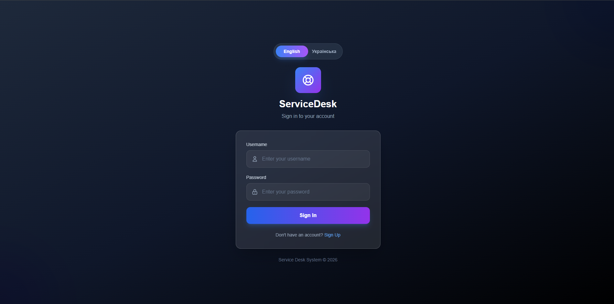
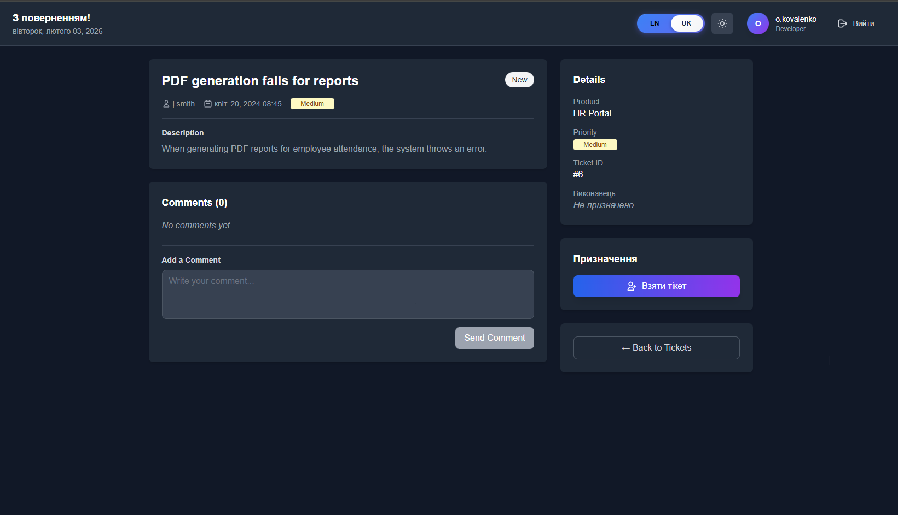
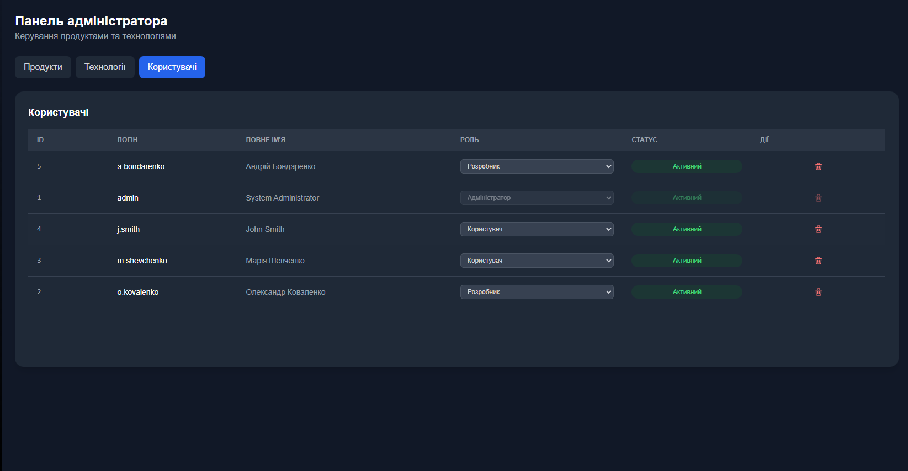
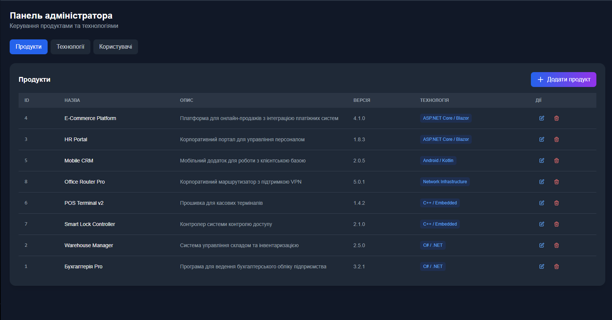
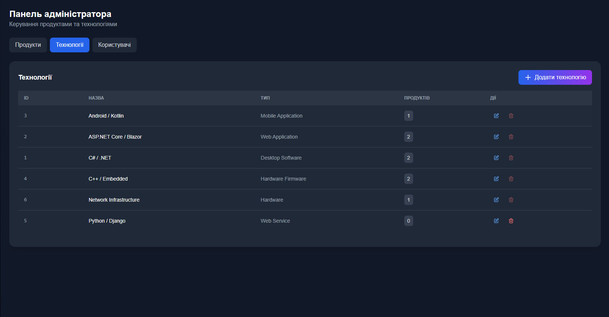
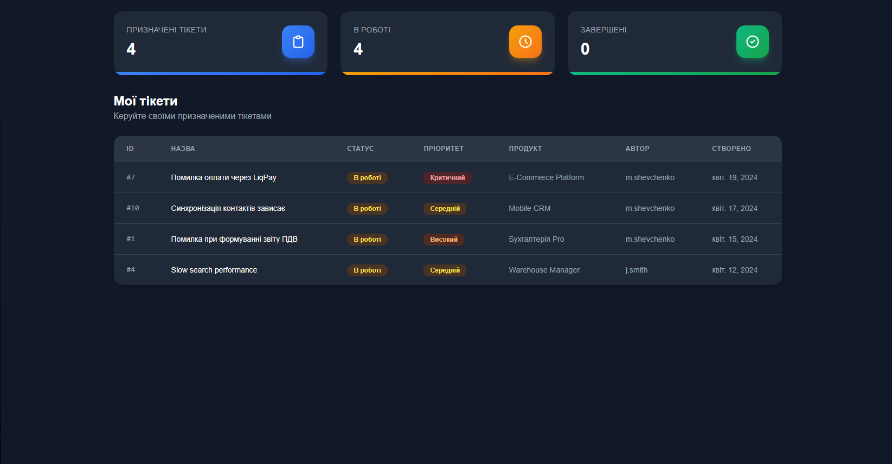

#  ServiceDesk - IT Service Management System

  

  
  
  
  
  

  <strong>A modern, comprehensive IT Service Desk and Incident Management system</strong>

---

##  Overview

**ServiceDesk** is a powerful IT Service Management (ITSM) platform built with **.NET 10** and **Blazor Server**, designed to streamline incident tracking, service requests, and team collaboration. With multilingual support (English & Ukrainian), intuitive UI, and robust backend, it's perfect for IT departments of any size.

###  Key Highlights

-  **Real-time incident & request tracking**
-  **Multilingual interface** (English/Ukrainian)
-  **Interactive dashboards & analytics**
-  **Role-based access control (RBAC)**
-  **SLA management & escalations**
-  **Modern UI with Tailwind CSS**
-  **Built with .NET 10 & Blazor Server**

## What it’s for
- Centralize incident and request tracking.
- Enforce transparent SLAs and execution control.
- Improve communication between requesters and assignees.
- Provide analytics and dashboards to manage workload and service quality.

## Key capabilities
- Creation and routing of incidents/requests.
- Categorization, priorities, states, and change history.
- SLA policies and escalations.
- Notifications for assignees and requesters.
- Roles and access control.
- Search, filters, dashboards, and reports.

## Architectural notes
- **Interface**: Blazor Server (interactive UI without a separate SPA client).
- **Server**: ASP.NET Core, C#.
- **Data**: MySQL; migrations supported (typically EF Core).
- **UI**: HTML, CSS; auxiliary JavaScript when needed.
- **Automation/scripting**: PowerShell.

## Target use cases
- IT Service Desk in internal IT departments.
- Incident Management for critical services.
- Service catalog and service request handling.
- Metric collection for reporting and SLA improvement.

## 📸 Screenshots

<b> Authentication & Login</b>

### Login Page (English)

### Login Page (Ukrainian)

<b> Dashboard & Tickets</b>

### Main Dashboard

### Ticket Details

<b> Admin Panel</b>

### Admin Panel

### Product Management

### Tech Stack Management

### Developer Panel

---

##  Project Status

>  **Active Development**: This repository is under active development. Features and capabilities may evolve.

### Current Version
- **Phase**: Beta
- **Framework**: .NET 10
- **Database**: MySQL 8.0+

---

##  Roadmap

###  Planned Features

- [ ] **Advanced SLA Policies**: Automated escalations and SLA breach notifications
- [ ] **Email Integration**: SMTP support for notifications
- [ ] **Chat Integration**: Teams/Slack webhook integration
- [ ] **KPI Dashboards**: MTTR, MTBF, SLA compliance metrics
- [ ] **Enhanced RBAC**: Expanded role management and permissions
- [ ] **Audit Logging**: Comprehensive system activity tracking
- [ ] **Knowledge Base**: FAQ and self-service modules
- [ ] **Mobile App**: Native mobile applications for iOS/Android
- [ ] **API**: RESTful API for third-party integrations
- [ ] **Reporting**: Advanced reporting and analytics engine

---

##  Contributing

We welcome contributions! Here's how you can help:

1.  **Report Bugs**: Open an issue with detailed reproduction steps
2.  **Suggest Features**: Share your ideas for new functionality
3.  **Submit Pull Requests**: Follow our coding conventions
4.  **Improve Documentation**: Help us make the docs better
5.  **Star the Project**: Show your support!

### Development Guidelines
- Follow C# coding conventions
- Write unit tests for new features
- Update documentation for any changes
- Use descriptive commit messages

---

##  Contact & Support

-  **Bug Reports**: [Open an Issue](https://github.com/Na3ikus/ServiceRequestApp/issues)
-  **Discussions**: [GitHub Discussions](https://github.com/Na3ikus/ServiceRequestApp/discussions)
-  **Feature Requests**: Share your ideas via Issues
-  **Email**: For private inquiries

---

##  License

This project is licensed under the MIT License - see the [LICENSE](LICENSE) file for details.

---

  <a href="#top"> Back to Top</a>

