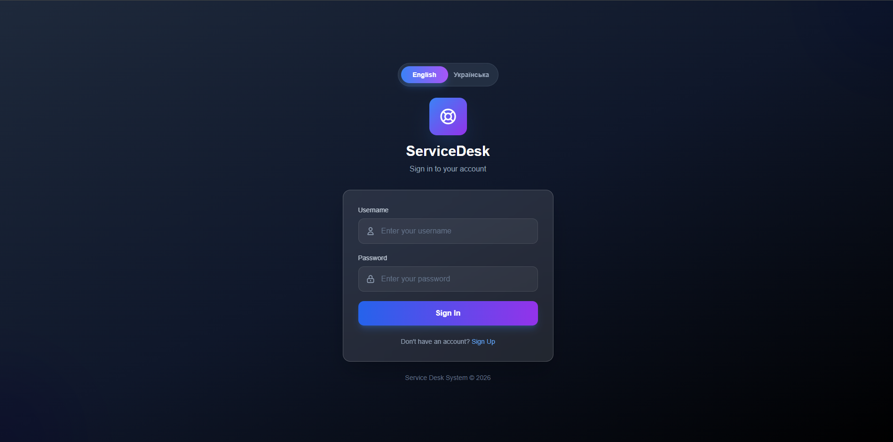
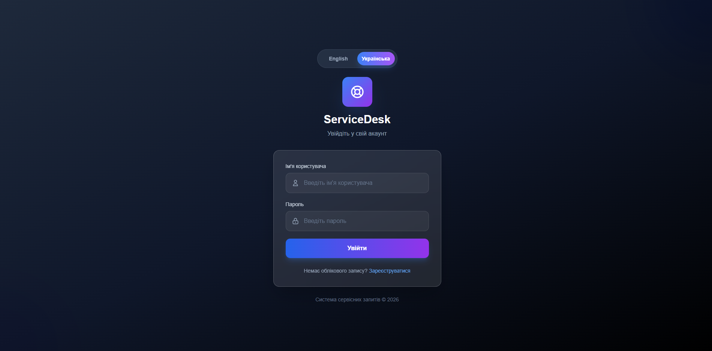
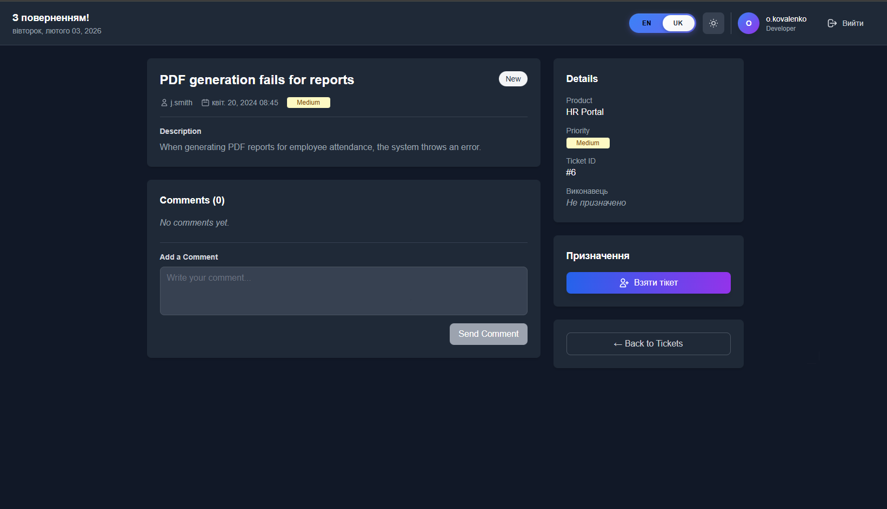
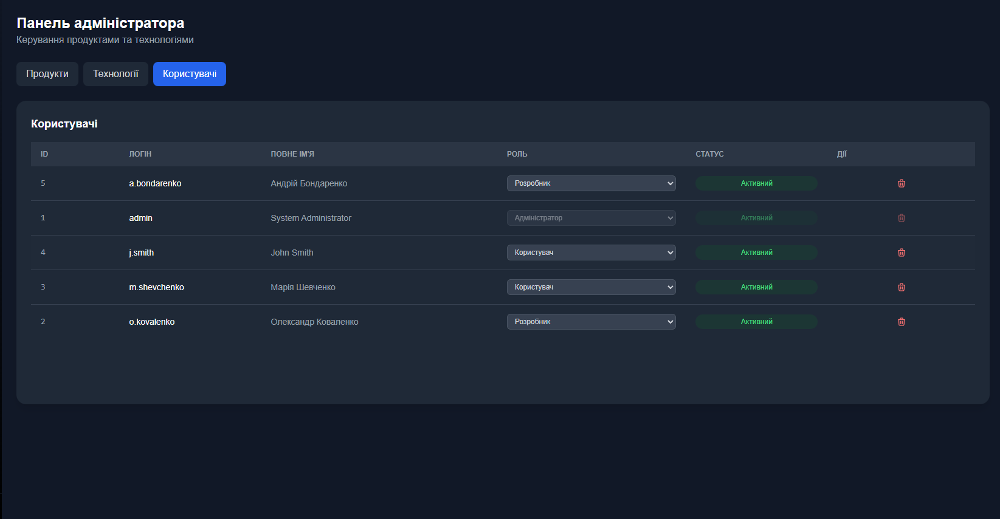
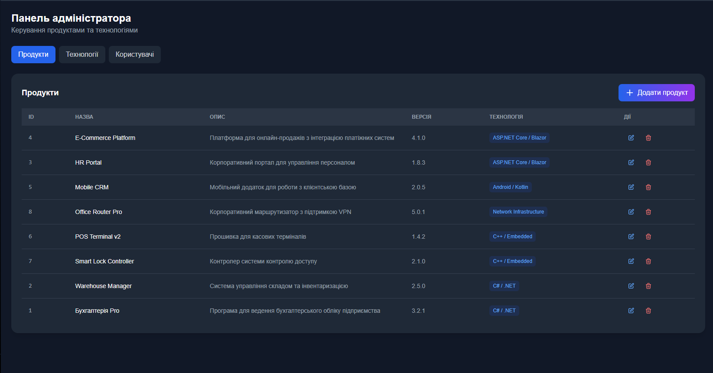
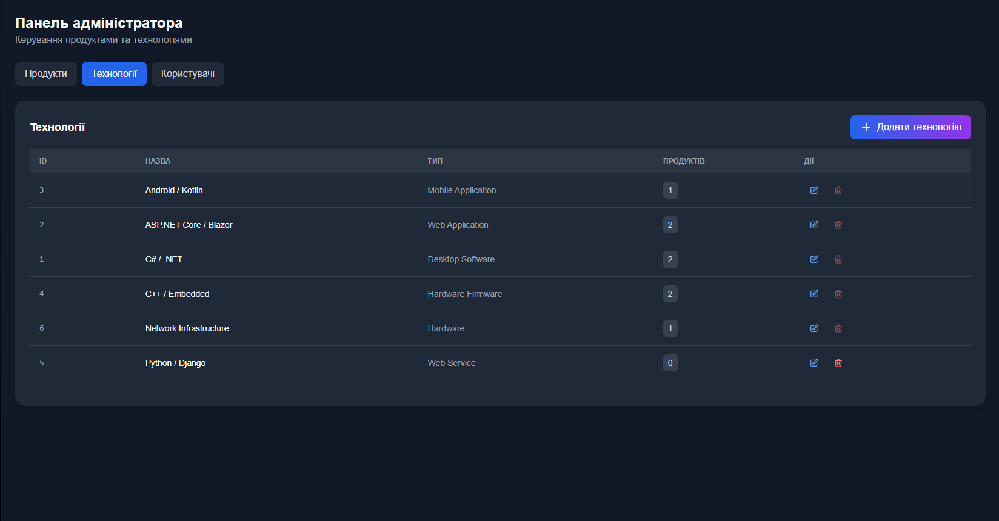
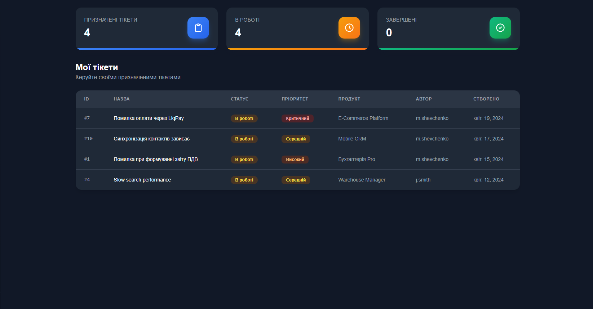

# 🛠️ ServiceDesk - IT Service Management System

  

  
  
  
  
  

---

## 📌 Overview

**ServiceDesk** is a modern, responsive IT Service Management (ITSM) system built with **.NET 10** and **Blazor Server**. It simplifies incident tracking, SLA management, and team collaboration with native multilingual support (English & Ukrainian) and role-based access control (RBAC).

> 💻 **Setup Note**: Uses a local MySQL database. Connection settings are in `appsettings.Development.json`. For Docker deployment, use environment variables.

---

## 📸 System Screenshots

### 🔑 Authentication & Login
| English Version | Ukrainian Version |
| :---: | :---: |
|  |  |

### 📊 Dashboard & Tickets
| Main Dashboard | Ticket Details |
| :---: | :---: |
|  |  |

### ⚙️ Management & Panels
| Admin Panel | Product Management |
| :---: | :---: |
|  |  |

| Tech Stack Management | Developer Panel |
| :---: | :---: |
|  |  |

---

## 🗺️ Roadmap & Features

- [x] **Multilingual UI** (English/Ukrainian)
- [x] **Interactive Dashboard** (MTTR, MTBF, SLA compliance metrics)
- [x] **Enhanced RBAC** (Role-Based Access Control & Permissions)
- [x] **Email Integration** (SMTP notifications)
- [x] **Mobile Adaptation** (Native mobile web-app for phones)
- [x] **RESTful API** for third-party integrations
- [ ] **Advanced SLA Policies** (Automated escalations & breach notifications)
- [ ] **Chat Integration** (Teams & Slack webhooks) ???
- [x] **Audit Logging** (Comprehensive system activity tracking)
- [ ] **Knowledge Base** (FAQ & self-service modules)
- [ ] **Advanced Reporting** (Analytics and export engine)

---

## ⚙️ Tech Stack

- **Frontend:** Blazor Server + Tailwind CSS (dynamic, interactive UI)
- **Backend:** ASP.NET Core (.NET 10)
- **Database:** MySQL 8.0+ (Entity Framework Core)

---

## 📄 License & Info

Licensed under the [MIT License](LICENSE). Contributions, issues, and feature requests are welcome!
