# 🛠️ ServiceDesk — IT Service Management System

  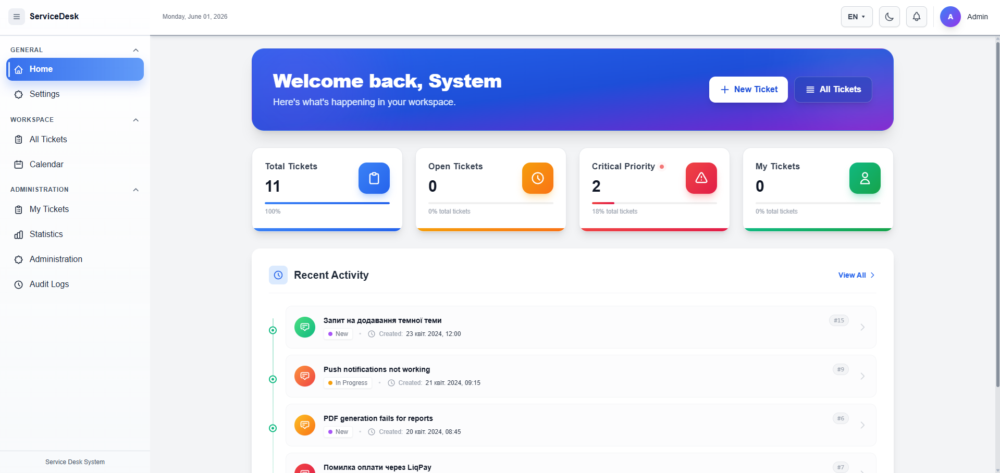

  
  
  
  
  
  

---

## 📌 Overview

**ServiceDesk** is a modern, responsive IT Service Management (ITSM) system built with **.NET 10** and **Blazor Server**. It simplifies incident tracking, SLA management, and team collaboration with native multilingual support (🇬🇧 English / 🇺🇦 Ukrainian) and role-based access control (RBAC).

> 💻 **Setup Note:** Uses a local MySQL database. Connection settings are in `appsettings.Development.json`. For Docker deployment, use environment variables.

---

## 🏗️ Architecture

The project is built on **Clean Architecture** principles, separating concerns into four independent layers. The **Domain** layer defines the core entities (Ticket, User, Product, etc.) and interfaces with no external dependencies. The **Application** layer orchestrates business logic and use cases on top of those interfaces. The **Infrastructure** layer provides concrete implementations — EF Core persistence, MySQL, SMTP email, and migrations. Finally, two presentation entry points sit at the top: a **Blazor Server** app for the interactive UI (over SignalR) and a **REST API** for third-party integrations.

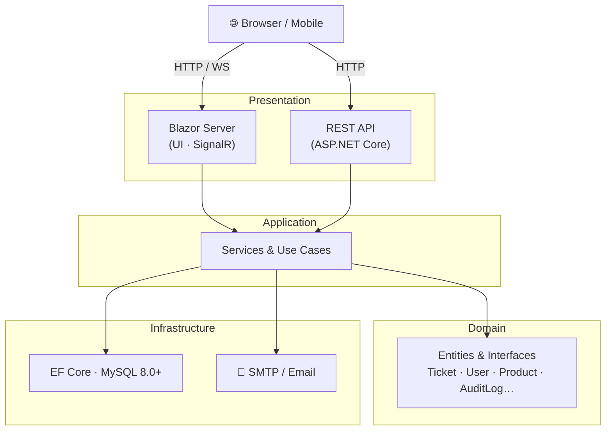
```mermaid
graph TD
    Browser["🌐 Browser / Mobile"]

    subgraph Presentation
        Blazor["Blazor Server\n(UI · SignalR)"]
        API["REST API\n(ASP.NET Core)"]
    end

    subgraph Application
        AppSvc["Services & Use Cases"]
    end

    subgraph Domain
        Entities["Entities & Interfaces\nTicket · User · Product · AuditLog…"]
    end

    subgraph Infrastructure
        EF["EF Core · MySQL 8.0+"]
        SMTP["📧 SMTP / Email"]
    end

    Browser -->|HTTP / WS| Blazor
    Browser -->|HTTP| API
    Blazor --> AppSvc
    API --> AppSvc
    AppSvc --> Entities
    AppSvc --> EF
    AppSvc --> SMTP
```

---

## 📸 Screenshots

### 🔑 Authentication

| Dark Mode | Light Mode |
| :---: | :---: |
| 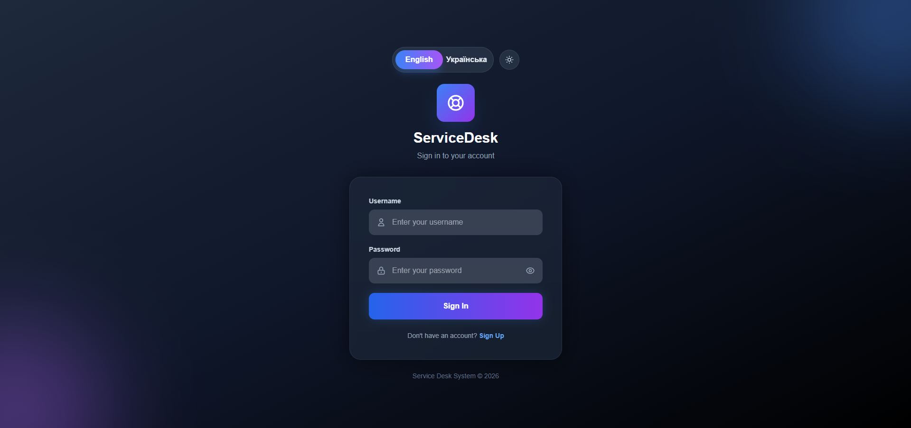 | 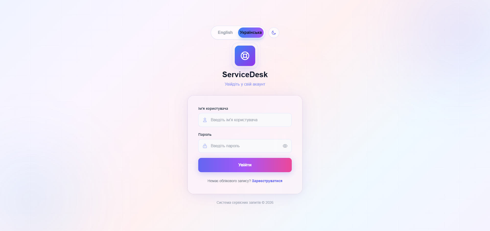 |

### 📊 Dashboard & Analytics

| Main Dashboard | Statistics |
| :---: | :---: |
|  | 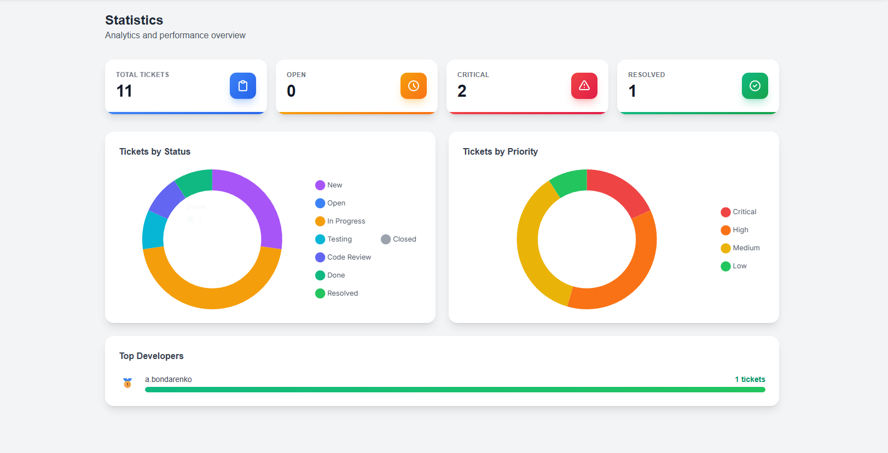 |

### 🎫 Ticket Management

| Ticket Details |
| :---: |
| 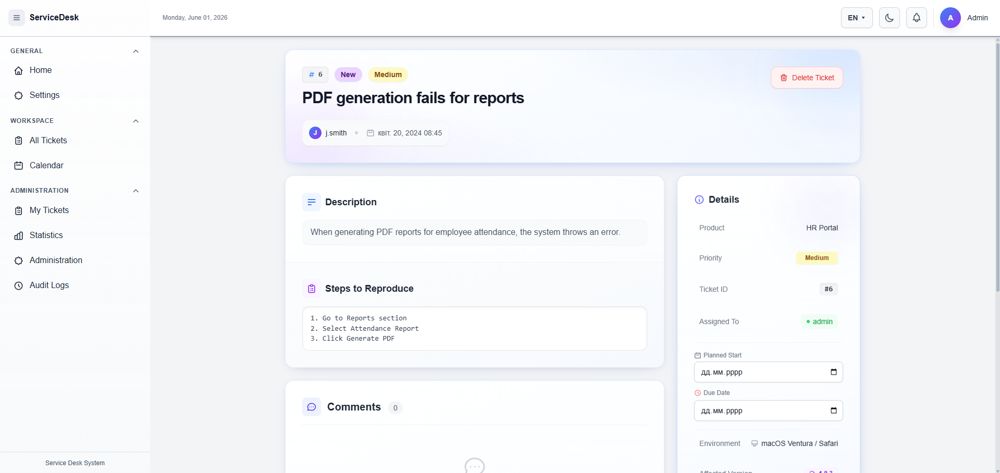 |

### ⚙️ Admin Panel

| User Management | Product Management |
| :---: | :---: |
| 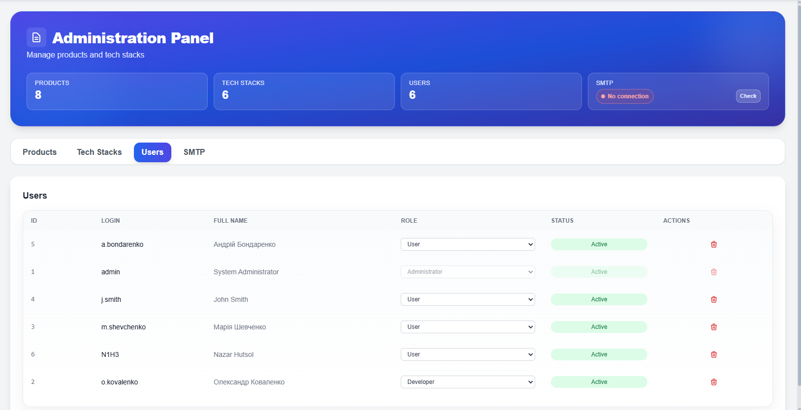 | 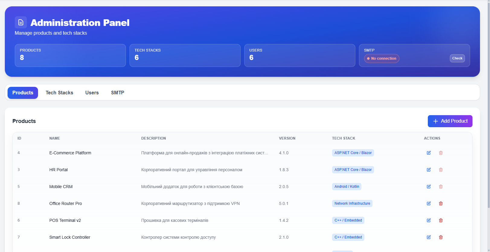 |

| Tech Stack Management | SMTP Settings |
| :---: | :---: |
| 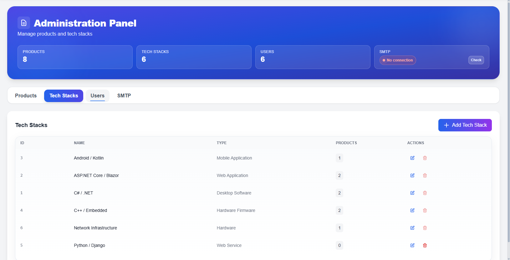 | 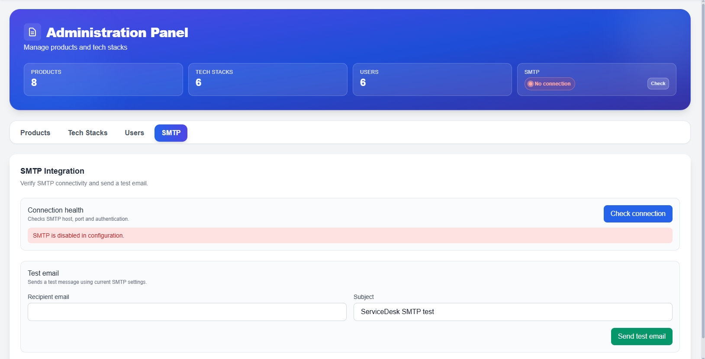 |

### 📋 Audit Logs

| Activity Tracking |
| :---: |
| 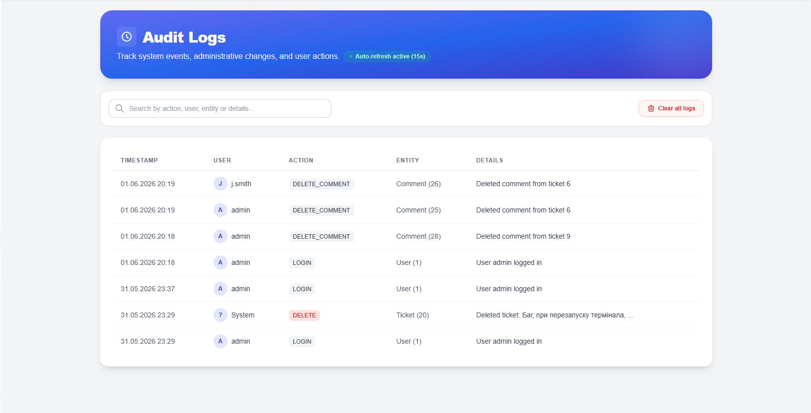 |

---

## ✅ Features

| Feature | Status |
|---|:---:|
| Multilingual UI (EN / UA) | ✅ |
| Interactive Dashboard (MTTR, MTBF, SLA) | ✅ |
| Role-Based Access Control (RBAC) | ✅ |
| Email Notifications (SMTP) | ✅ |
| Mobile-Responsive Web App | ✅ |
| RESTful API | ✅ |
| Audit Logging | ✅ |
| Advanced SLA Policies & Escalations | 🔜 |
| Knowledge Base & Self-Service | 🔜 |
| Advanced Reporting & Export | 🔜 |

---

## ⚙️ Tech Stack

| Layer | Technology |
|---|---|
| Frontend | Blazor Server + Tailwind CSS |
| Backend | ASP.NET Core (.NET 10) |
| Database | MySQL 8.0+ via Entity Framework Core |
| Containerization | Docker |

---

## 📄 License

Licensed under the [MIT License](LICENSE). Contributions, issues, and feature requests are welcome!
